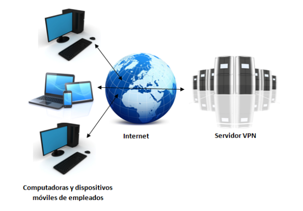
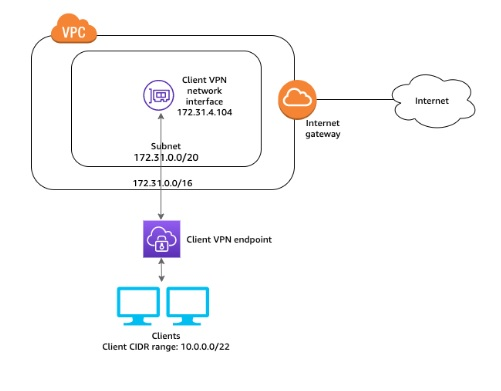
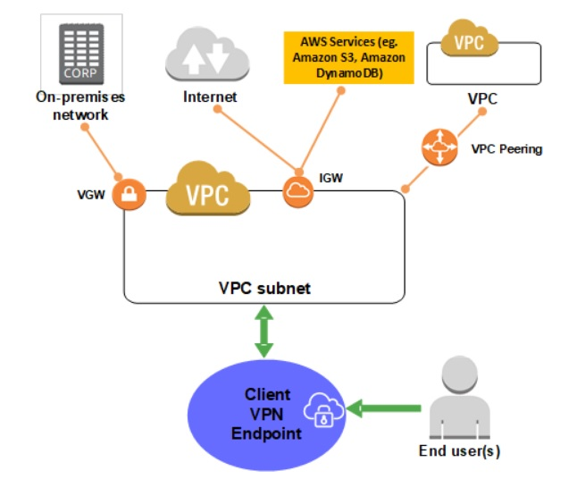

<!--Como configurar una VPN--> 

# Universidad Mariano Gálvez
# Sede Boca del Monte
# Seguridad y Auditoria de Sistemas

# Ing. Melvin Calí
# Proyecto II
## Configuracion de una Intranet

## Miembros del Grupo:
1. Eliezer Méndez 7690-14-9683
2. Sergio Tzalam 7672-16-3621
3. Geoffrey Hernández 7690-14-3807

# Introducción

Actualmente, la tecnología está presente prácticamente en todos los ámbitos y requerimientos
laborales. La disponibilidad de nuevas herramientas y la necesidad de una comunicación cada vez
más ágil en las empresas, dieron nacimiento a lo que hoy se llama Intranet; una red interna de
comunicación e información que emplea la misma tecnología que se utiliza en internet, siendo
accesible única y exclusivamente para los usuarios miembros de la Organización.

Para el presente Proyecto se elaborò una Intranet con las configuraciones de:

* DNS
* DHCP
* Servidor de base de datos instalada en Unix
* Directorio de activos
* Politicas de usuarios, roles y/o perfiles
* Sistemas Operativos (Windows, Gnu/Linux)

Bajo las siguientes Condiciones:
1. Implementar un servidor de VPN (contratar un VPS para tener la IP pública), asi también como tambièn un Dominio.
2. Crear un servidor de directorio de activos

Para la realización de este proyecto todas las configuraciones fueron logicas, por consiguiente este proyecto se realizó en la nube, especificamente en el sitio de AWS.

## Concepto de Intranet

Las intranets son redes privadas que se han creado utilizando las normas y protocolos de Internet. Aportan la interfaz de exploración del World Wide Web (www) a la información y servicios almacenados en una red de área local (LAN) corporativa. Las intranets son atractivas por que disminuyen el costo de mantenimiento de una red interna y, al mismo tiempo, aumenta la productividad, ya que ofrece a los usuarios acceso mas eficaz a la información y a los servicios que necesitan.

Con el enorme crecimiento de Internet, un gran numero de personas en las empresas usan Internet para comunicarse con el mundo exterior, para reunir información, y para hacer negocios. A la gente no le lleva mucho tiempo reconocer que los componentes que funcionan tan bien en Internet serían del mismo modo valioso en el interior de sus empresas y esa es la razón por la que las Intranets se están haciendo tan populares.

La Intranet esta basada en los estándares y protocolos abiertos desarrollados en Internet. Estos estándares abiertos soportan aplicaciones y servicios como correo electrónico (e-mail), trabajo en grupo (work group), servicio de directorio, seguridad, acceso a bases de datos, compartición de información y administración de sistema. La Intranet se beneficia del esfuerzo de la industria entera y no de un solo fabricante.

# Configuraciones:
## Servidor Dedicado Virtual (VPS, Virtual Prívate Server)
Esta es una solución intermedia en la que se sigue compartiendo el servidor con otros clientes,
pero se tiene el propio software-partición que permite un mayor control de la configuración, este
alojamiento está indicado para webs de pequeñas y medianas empresas.

## VPN

Una VPN (Virtual Private Network) es una tecnología de red que se utiliza para conectar una o más computadoras a una red privada utilizando Internet. las empresas suelen utilizar estas redes para que sus empleados, desde sus casas, hoteles, etc., puedan acceder a recursos corporativos que, de otro modo, no podrían. Sin embargo, conectar la computadora de un empleado a los recursos corporativos es tan solo una de las funciones de una VPN.

## Configuración de una VPN

Como configurar una VPC con al menos una subred y un gateway de Internet. La tabla de rutas asociada a la subred debe tener una ruta al gateway de Internet.

## Paso 1: 
En nuestro caso utilizamos la  autenticación mutua. Con la autenticación mutua, el cliente VPN utiliza certificados para realizar la autenticación entre el cliente y el servidor.

Si desea conocer en detalle los pasos necesarios para generar los certificados y las claves del cliente y del servidor, veamos los siguientes pasos:

### Autenticación
La autenticación es lo primero que se implementa en la nube de AWS. Se utiliza para determinar si los clientes tienen permiso para conectarse al punto de enlace de Client VPN. Si la autenticación se realiza correctamente, los clientes se conectan al punto de enlace del Cliente VPN y establecen una sesión de VPN. Si la autenticación falla, se deniega la conexión y el cliente no podrá establecer una sesión de VPN.

### 1 Autenticación con Active Directory
Client VPN permite el uso de Active Directory al integrarse con AWS Directory Service. Con la autenticación de Active Directory, los clientes se autentican en grupos de Active Directory existentes. Con AWS Directory Service, El cliente VPN puede conectarse a los Active Directory existentes aprovisionados en AWS o en la red en las instalaciones. Esto le permite utilizar su infraestructura de autenticación del cliente existente. 

## Paso 2: Crear un punto de enlace de Client VPN

Cuando se crea un punto de enlace de Client VPN, se genera la construcción de VPN a la que pueden conectarse los clientes para establecer una conexión de VPN.

1. Abrimos la consola de Amazon VPC.

2. En el panel de navegación, elejimos Cliente VPN Endpoints (Puntos de enlace de Client VPN) y Create Client VPN Endpoint (Crear punto de enlace de Client VPN).

3. Escriba un nombre y una descripción del punto de enlace de Client VPN (Esto es opcional) .

4. En Client IPv4  especifique el rango de direcciones IP,  desde el que se van a asignar las direcciones IP del cliente. 

5. En Server certificate ARN (ARN del certificado del servidor, especifique el ARN del certificado TLS que va a utilizar el servidor. Los clientes utilizan el certificado de servidor para autenticar el punto de enlace de Client VPN al que están conectados.

6. Especifique el método de autenticación que se va a utilizar para autenticar los clientes al establecer una conexión de VPN. 

7. En la prgunta que le aparecera a continuación ¿Desea registrar los detalles de las conexiones del cliente?), elija No.

8. Deje los demás valores predeterminados y elija Create Cliente VPN Endpoint (Crear punto de enlace de Client VPN).

## Paso 3: Habilitar la conectividad de VPN para clientes

Para que los clientes puedan establecer una sesión de VPN, debe asociar una red de destino con el punto de enlace de Client VPN. Una red de destino es una subred en una VPC.

1. Para asociar una subred con el punto de enlace de Client VPN

2. Abrimos la consola de Amazon VPC en

3. En el panel de navegación, elija Puntos de enlace de Client VPN.

4. Seleccione el punto de enlace de Client VPN al que desea asociar la subred y elija Asociaciones, Asociar.

5. En VPC, elija la VPC en la que se encuentra la subred. Si especificó una VPC al crear el punto de enlace de Cliente VPN, tiene que ser la misma VPC.

6. En Subred que se va a asociar, elija la subred que desee asociar con el punto de enlace de Cliente VPN.

7. Elija Asociate.

Al asociar la primera subred con el punto de enlace de Client VPN, sucede lo siguiente:

El estado del punto de enlace de Client VPN cambia a available. Los clientes ahora pueden establecer una conexión de VPN, pero no pueden acceder a los recursos de la VPC hasta que se añadan las reglas de autorización.

La ruta local de la VPC se agrega automáticamente a la tabla de enrutamiento del punto de enlace de Cliente VPN.

El grupo de seguridad predeterminado de la VPC se aplica automáticamente para la asociación de subred.

## Paso 4: Autorizar a los clientes para obtener acceso a una red

Para autorizar a los clientes para obtener acceso a la VPC en la que se encuentra la subred asociada, debe crear una regla de autorización. La regla de autorización especifica qué clientes tienen acceso a la VPC

### Para añadir una regla de autorización a la red de destino

1. Abra la consola de Amazon VPC. 

2. En el panel de navegación, elija Puntos de enlace de Client VPN.

3. Seleccione el punto de enlace de Clienet VPN al que va a agregar la regla de autorización y elija Autorización y Autorización de entrada.

4. En Red de destino que se va a habilitar, escriba la CIDR, de la red para la que desee permitir el acceso. 

5. En Conceder acceso a, elija Permitir acceso a todos los usuarios.

6. En Descripción, escriba una breve descripción de la regla de autorización.

7. Seleccione Añadir regla de autorización.

8. Asegúrese de que los grupos de seguridad de los recursos de la VPC tengan una regla que permita el acceso desde el grupo de seguridad para la asociación de subred. Esto permite a sus clientes acceder a los recursos de su VPC.

## Paso 5: Descargar el archivo de configuración del punto de enlace del Cliente VPN.

El último paso que tiene que realizar es descargar y preparar el archivo de configuración del punto de enlace de Cliente VPN. El archivo de configuración contiene el punto de enlace de Cliente VPN y la información del certificado necesaria para establecer una conexión de VPN. Debe proporcionar este archivo a los clientes que necesiten conectarse al punto de enlace de Cliente VPN para que puedan establecer una conexión de VPN. El cliente carga este archivo en su aplicación cliente de VPN.

## Paso 6: Conectarse con el punto de enlace de Client VPN

Puede conectarse al punto de enlace de Client VPN utilizando el cliente proporcionado por AWS u otra aplicación cliente basada en OpenVPN.

# Registrar un nuevo dominio

En nuestro caso para registrar un dominio se utilizó Amazon Route 53, en esta sección especificamente nos permitió registrar el domino, y con este dominio podemos iniciar sesión en otros proveedores de DNS. Dependiendo del proveedor de DNS

## Registrar de Dominio con Route 53

1. Inicie sesión enAWS Management Consoley abra la consola de Route 53. 

2. En el panel de navegación, elija Dominios registrados.

3. SeleccionarRegistrar dominioy especifique el dominio que desea registrar:

4. Elija Continue.

5. En la página Detalles para su dominio, escriba la información de que le sea solicitada y de esa manera quedará registrado su Dominio..

## Creando la Maquina virtual de Windows

Especificaremos los pasos necesarios para la creación y configuración de la maquina virtual en Windows.

1. Lo primero que debemos de hacer es ir a configuraciones para la creación de una instancia.

2. En este apartado vamos a la opción de iniciar una nueva instancia.

3. Acá es donde buscamos la imagen de la máquina virtual que deseamos instalar.
* Debemos de tener claro cuales son nuestras necesidades para saber elegir nuestros recursos de la máquina: Memoria RAM, cantidad de almacenamiento, cantidad de nucleos, etc.

4. Luego seleccionados el par de claves autorizadas que utilizaremos para conectarnos a la máquina virtual.

5. Con los pasos anteriores hemos configurado nuestra máquina virtual de windows.

## Creando la Maquina virtual de Linux
Como en la sección anterior especificaremos los pasos necesarios para la creación y configuración de la maquina virtual de Linux.

1. Lo primero que debemos de hacer es ir a configuraciones para la creación de una instancia.

2. En este apartado vamos a la opción de iniciar una nueva instancia.

3. Acá es donde buscamos la imagen de la máquina virtual que deseamos instalar.
* Debemos de tener claro cuales son nuestras necesidades para saber elegir nuestros recursos de la máquina: Memoria RAM, cantidad de almacenamiento, cantidad de nucleos, etc.

4. Luego seleccionados el par de claves autorizadas que utilizaremos para conectarnos a la máquina virtual.

5. Con los pasos anteriores hemos configurado nuestra máquina virtual de windows.

# IP Pública

Las direcciones IP permiten que los recursos de la VPC se comuniquen entre sí y con otros recursos a través de Internet. Amazon EC2 y Amazon VPC admiten los protocolos de direcciones IPv4 e IPv6. 

De forma predeterminada se utilizó  el protocolo de direccionamiento IPv4. Al crear una VPC, debe asignarle un bloque de CIDR IPv4 (un rango de direcciones IPv4 privadas). No es posible obtener acceso a las direcciones IPv4 privadas a través de Internet. Para conectar su instancia a través de Internet o para habilitar la comunicación entre sus instancias y otros servicios de AWS con puntos de conexión públicos, puede asignar a su instancia una dirección IPv4 pública globalmente única.

